# akinterpreter的特性
## 1. 自动生成代码  
**扣德充沛**的前提是什么？当然是不用自己写代码！
akinterpreter自动生成代码,这个当然是akinterpreter的就基本功了。

## 2. 自动获取数据
其实吧，很多时候，分析不是最难的  
最难的事情是如何获取数据。  
这个就是akinterpreter的另一个基本功了，帮你自己获取数据。  
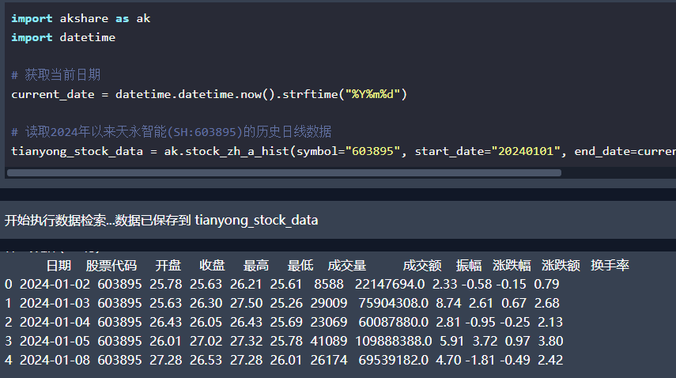  
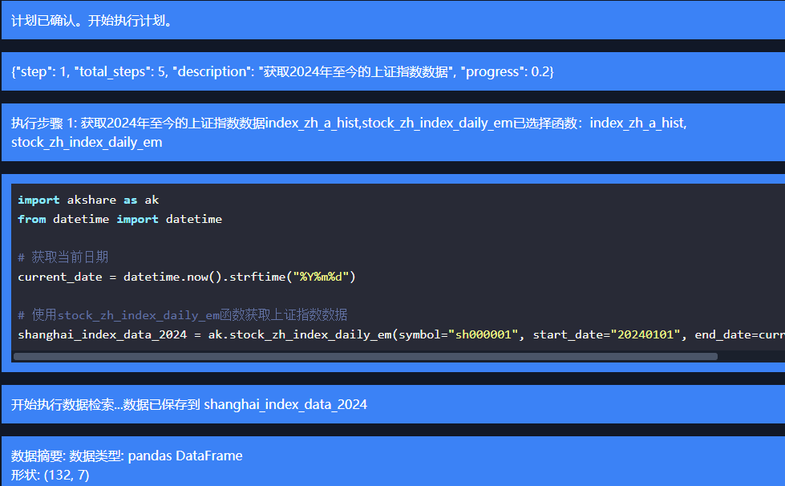

## 3. 自动修复代码
LLM生成的代码，有时候也会有bug  
如果被拖入bug的深渊，那扣德的人生也太辛苦了  
akinterpreter的自动修复代码功能，把该死的松弛感还给你  
  

## 4.自动生成计划
你可能会说，大家都想分析数据  
但是怎么才能按照自己心意来分析呢？  
难道按自己心意来不才是最重要的事情吗？   
是的，让代码符合自己的心意，但是自己又不用管代码是什么最重要！ 
akinterpreter有自动生成计划的功能，  
这还不止，你可以不断按自己的心意修改计划  
直到分析方法和过程符合你心意为止  
不会跑了半天，确发现过程和结果根本不是自己想要的  
akinterpreter根据你的心意去工作！  
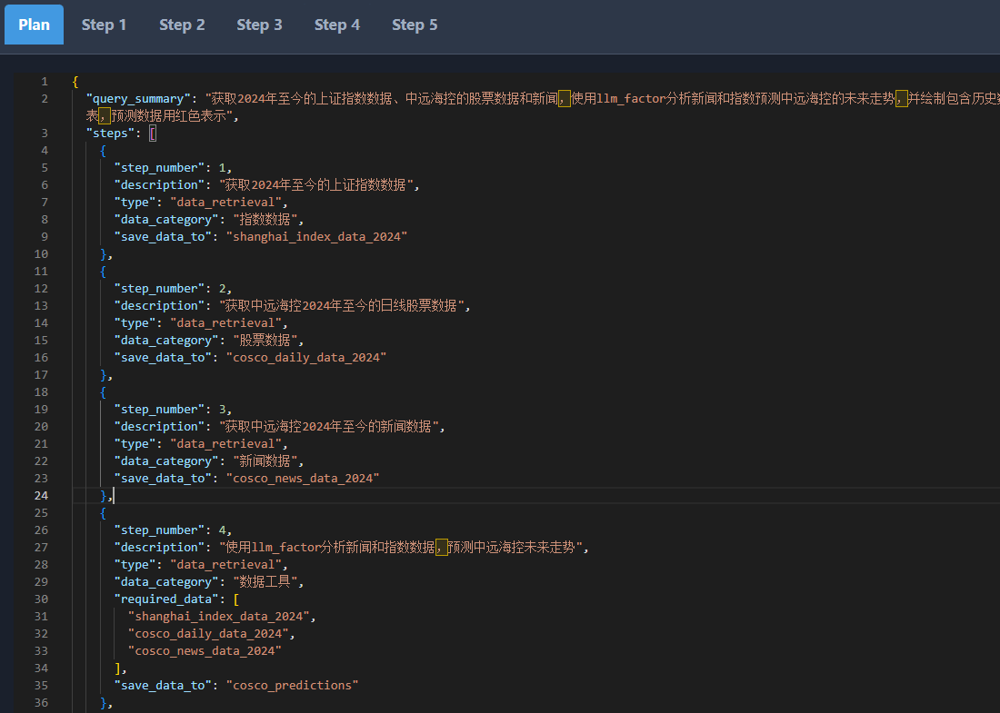  

## 5.用聊天的方式来修改计划
你可能会问，如果计划不符合心意，要怎么修改呢？  
当然是打字就可以！  
你想怎么改，你像告诉你新招来的助理一样  
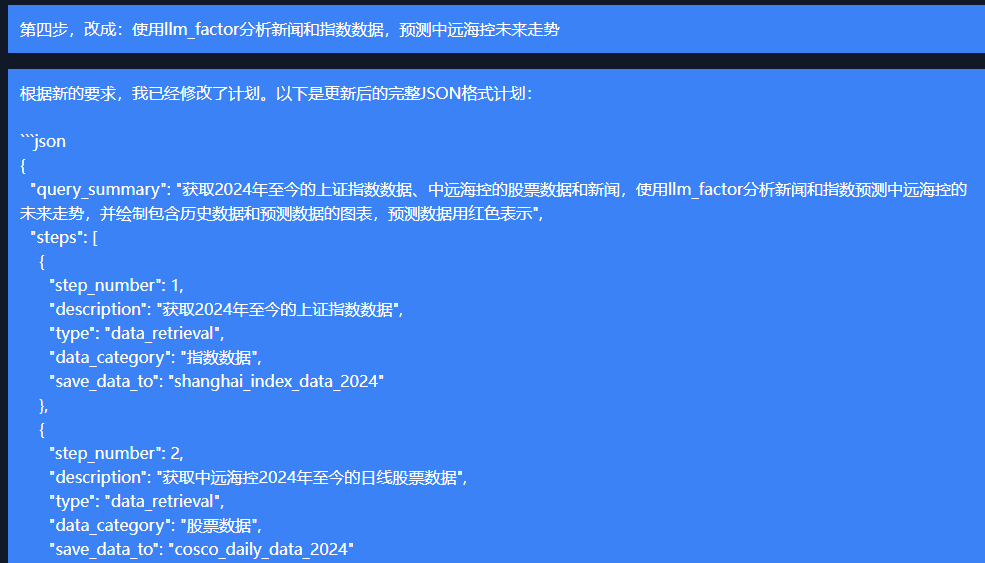  

## 6. 自动分析数据
分析数据，是一件花时间，花精力，但是还需要碰运气的事情  
akinterpreter是根据数据类型帮你自动分析数据  
这就很惬意了，帮你省去了观察数据的功夫  
  

## 7. 自动生成图表
这个你可能会问，那么，akinterpreter可以怎么分析数据呢？  
这么说，你想要的，都有！  
比如自动生成图表  
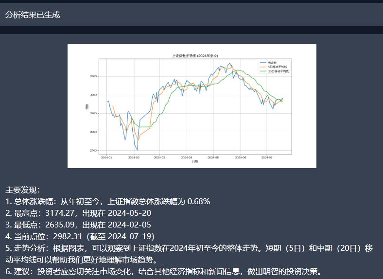  
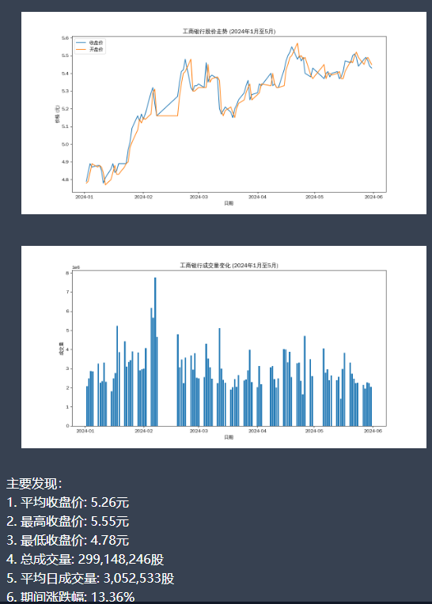
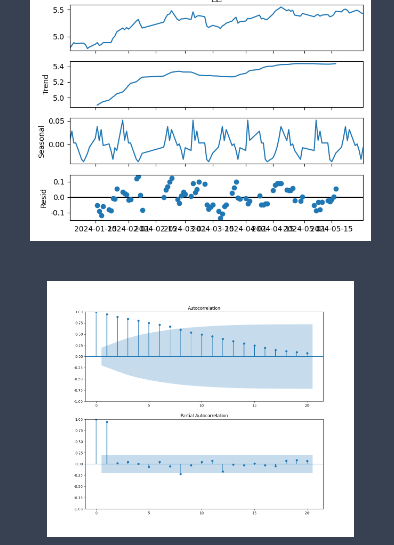

## 8. 自动生成报告
akinterpreter可以自动生成报告  
帮你省去了很多总结和洞察的时间
有没有感受到该死的松弛感又奔涌而来了
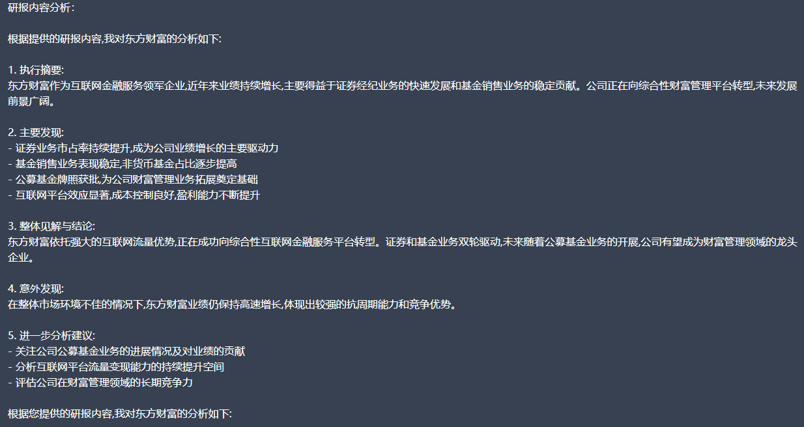  

## 9.one more thing
你以为只有这些吗？  
还有很多，很多，很多，等你去发现！  
现在就给你举一些栗子
### 1. 词云  
词云大家都喜欢吧  
不用写代码的词云来了  
  

### 2. 新闻分析  
新闻分析，你一定很熟悉吧  
是一个想做，但是又发现很难做的事情  
现在，新闻分析从未如此简单  
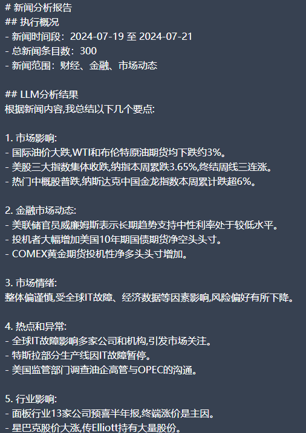  

### 3. 用LLM预测股票  
结合新闻和股票走势，预测接下来的走势  
使用的是最新的序列知识引导提示(Sequential Knowledge-Guided Prompting, SKGP)技术  
现在不用去阅读论文，就可以使用这个技术了  
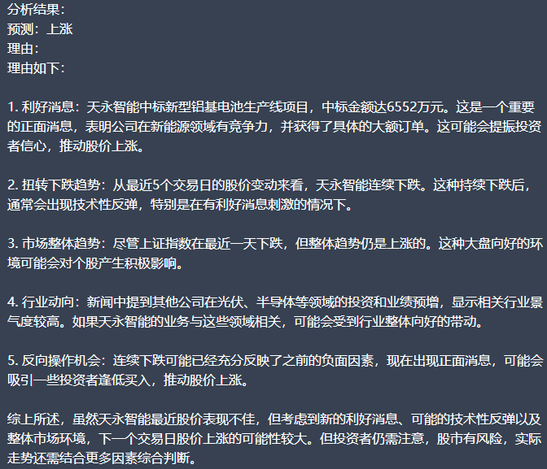  

### 4. 其他的预测技术
akinterpreter集成的预测技术不止一种！
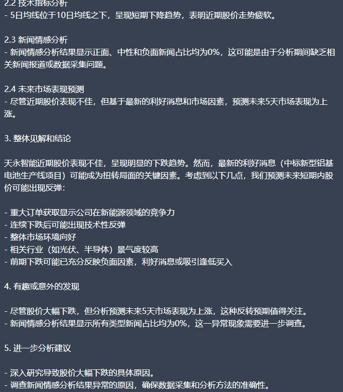  

## 10. 总结
akinterpreter试图让你充分利用大语言模型的潜力  
帮你去做一些有意义的事情    
让你**扣德充沛！**  
这里列举的也只是akinterpreter的能做的事情的冰山一角  
还有很多很多等着你发现！  
今天又是扣德充沛的一天！  
扣运昌隆！ 德气满满！  

