# akinterpreter Features

**English** | [简体中文](./demonstrate.zh-CN.md)

## 1. Generate Code Automatically

akinterpreter generates analysis code from natural-language requests.

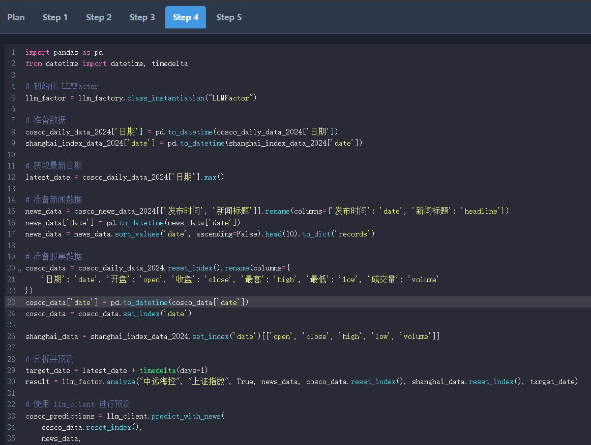

## 2. Retrieve Data Automatically

Financial analysis often starts with the difficult work of finding the right data. akinterpreter retrieves data for you.

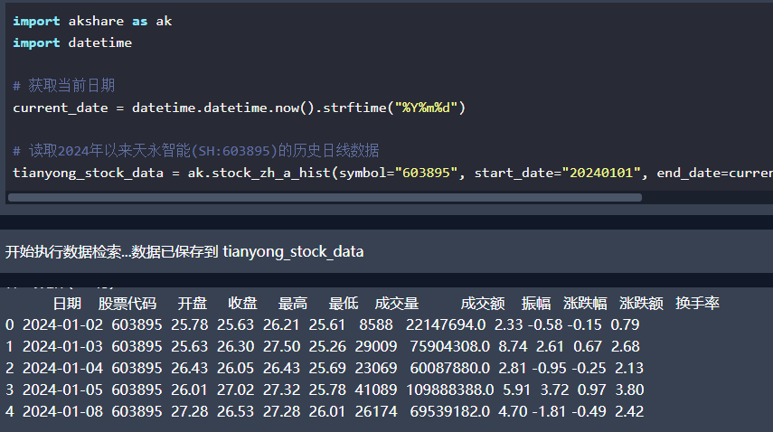
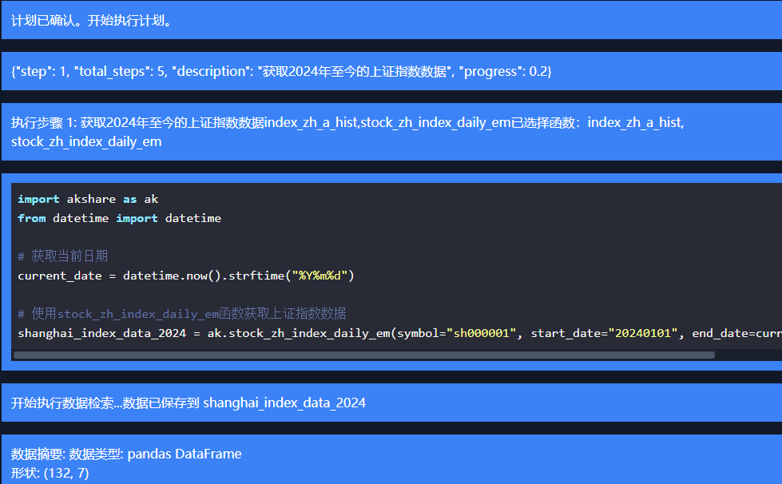

## 3. Repair Generated Code

Generated code can fail. akinterpreter can inspect errors and attempt corrections automatically.

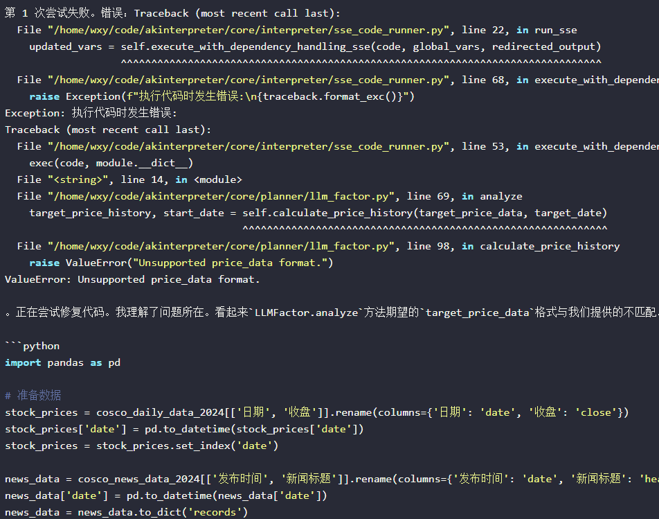

## 4. Generate Editable Plans

Before running an analysis, akinterpreter creates a multi-step plan. You can revise the plan until the method matches your goal.

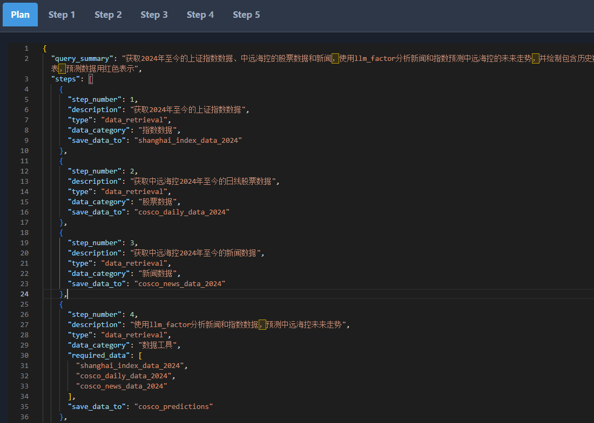

## 5. Revise Plans Through Chat

You can adjust the plan using natural-language instructions.

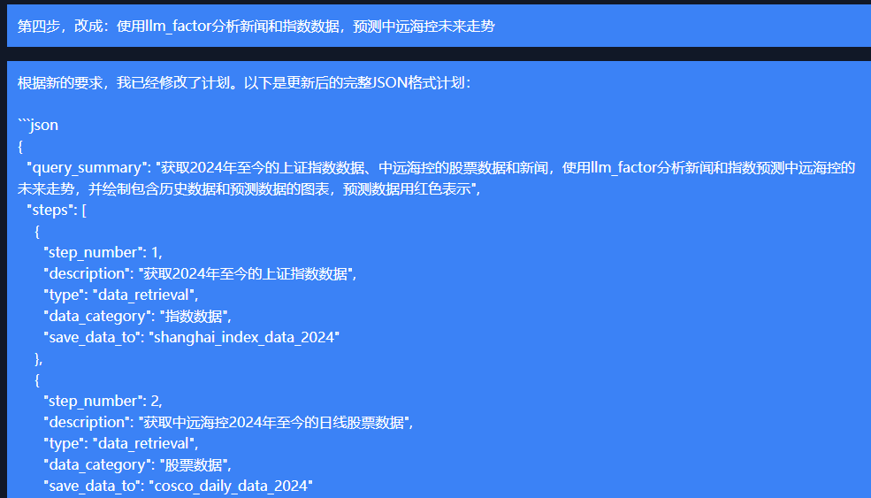

## 6. Analyze Data Automatically

akinterpreter selects analysis approaches based on the available data.

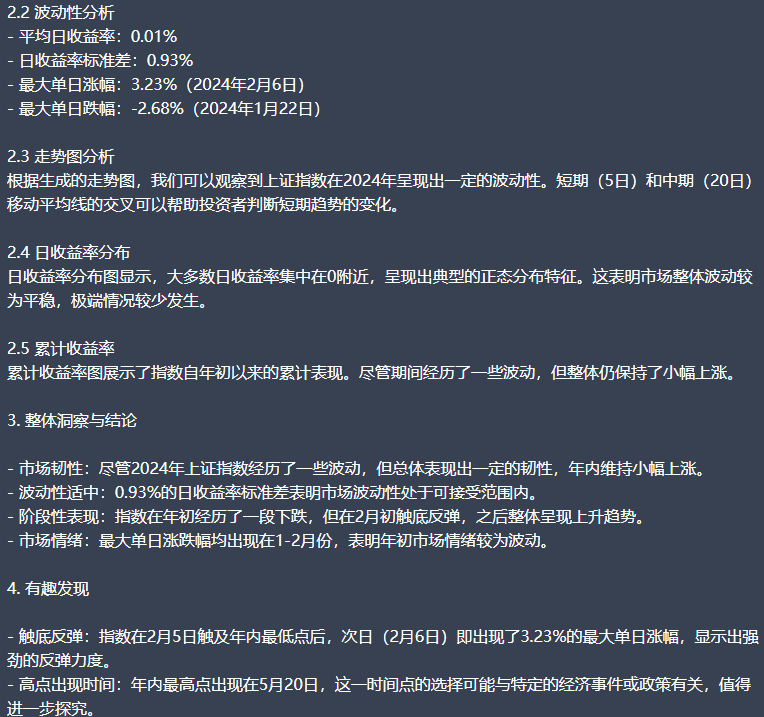

## 7. Generate Charts

The generated analysis can include visualizations.

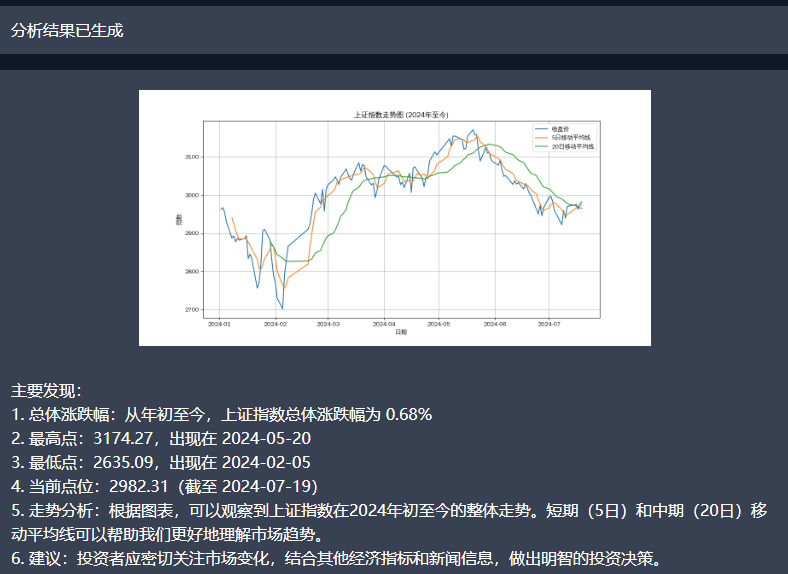
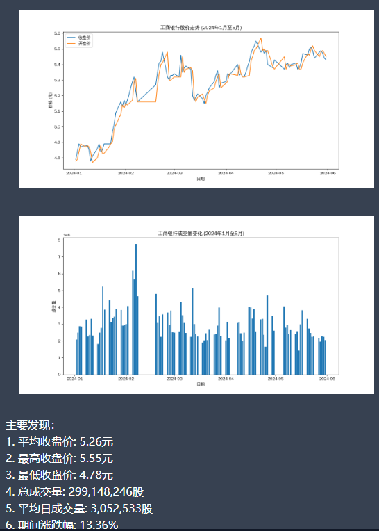
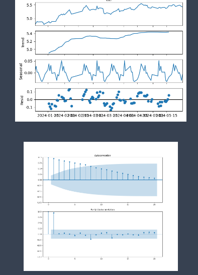

## 8. Generate Reports

akinterpreter summarizes analysis results into reports.

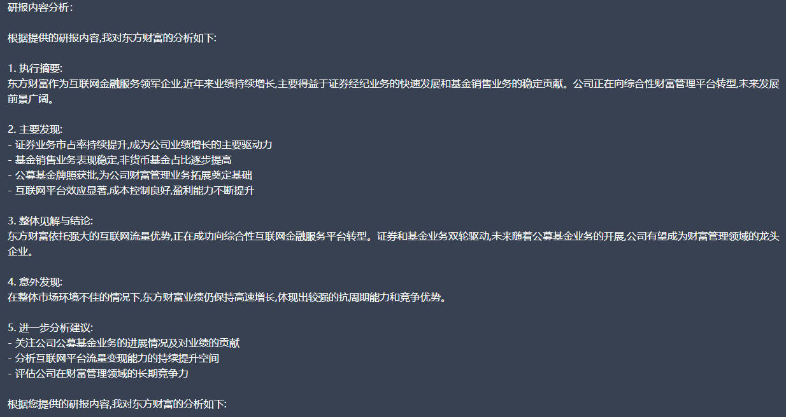

## 9. Additional Examples

### Word Clouds

### News Analysis

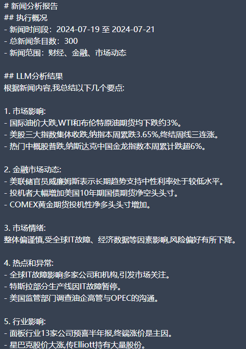

### LLM-Based Stock Prediction

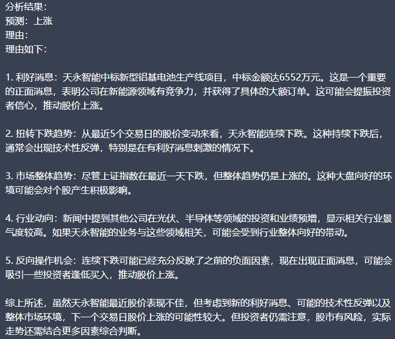

### Other Prediction Methods

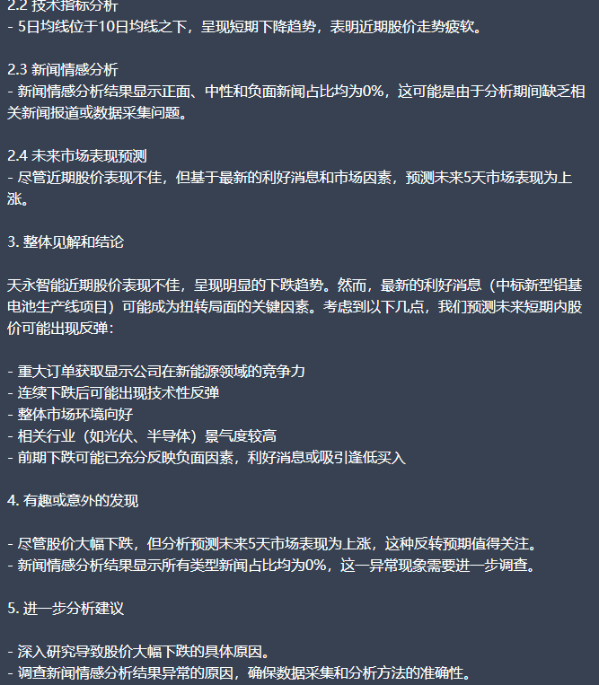

## Summary

akinterpreter is designed to help you use LLMs for practical data retrieval, analysis, visualization, and reporting workflows.

